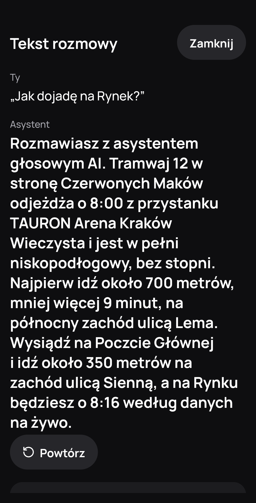
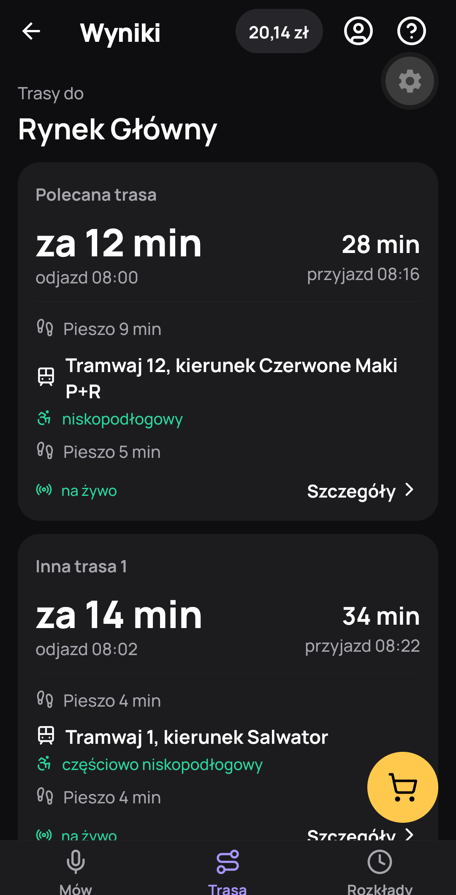
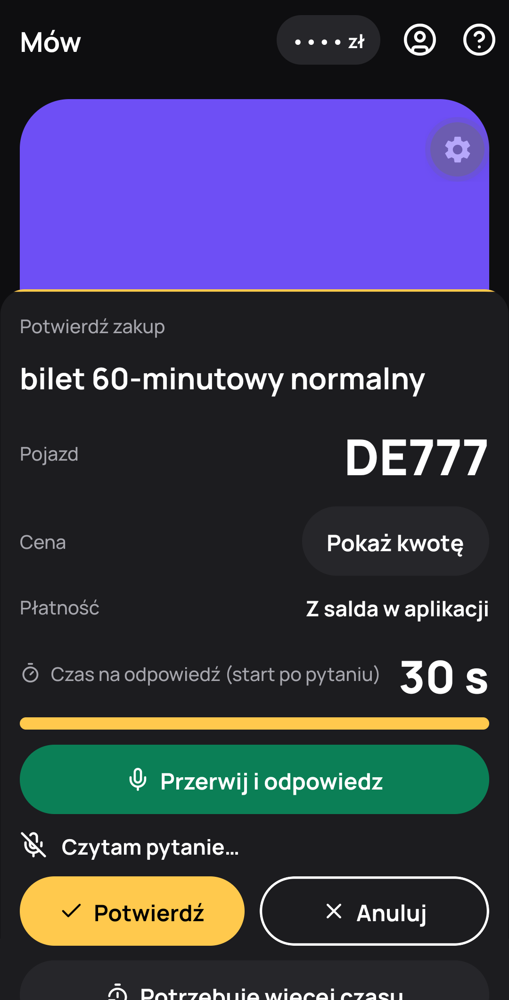
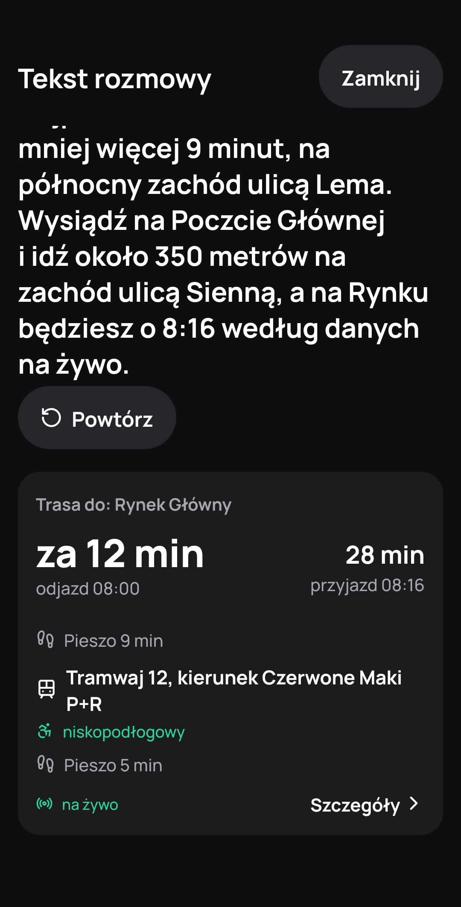
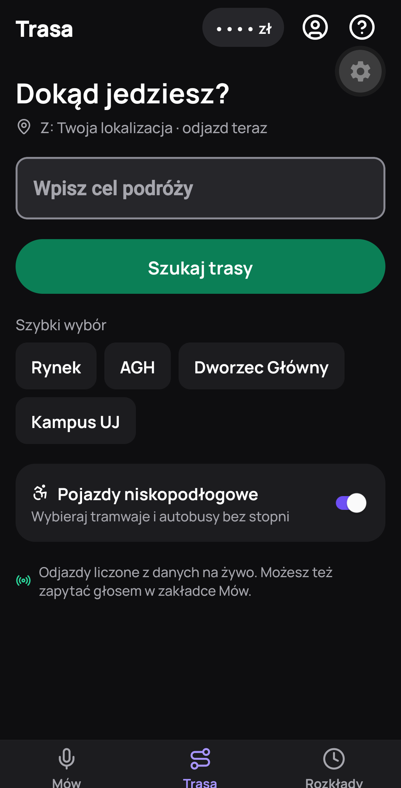
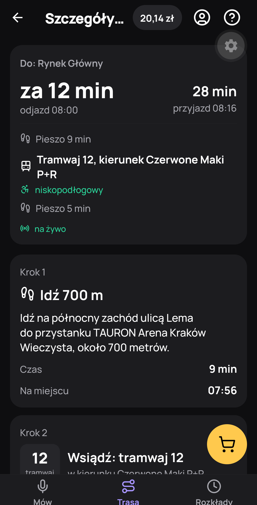
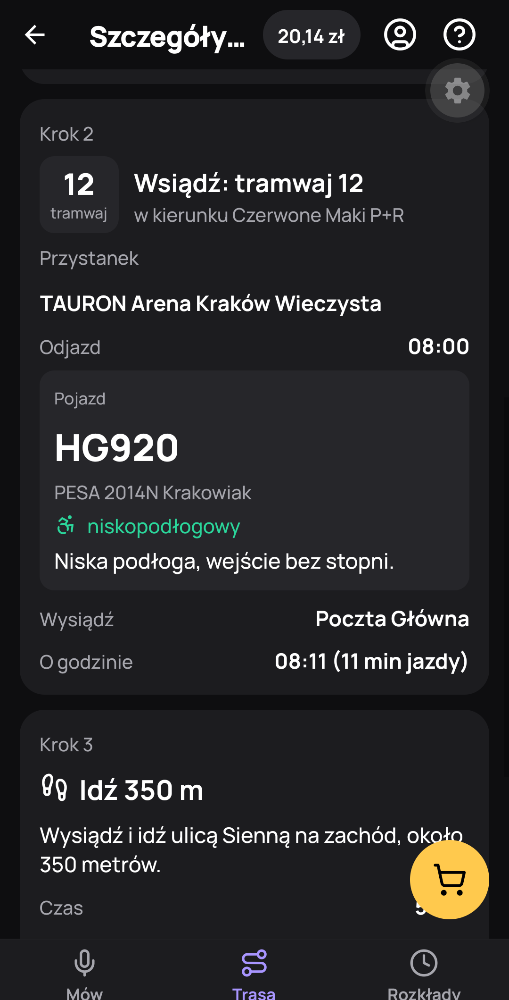
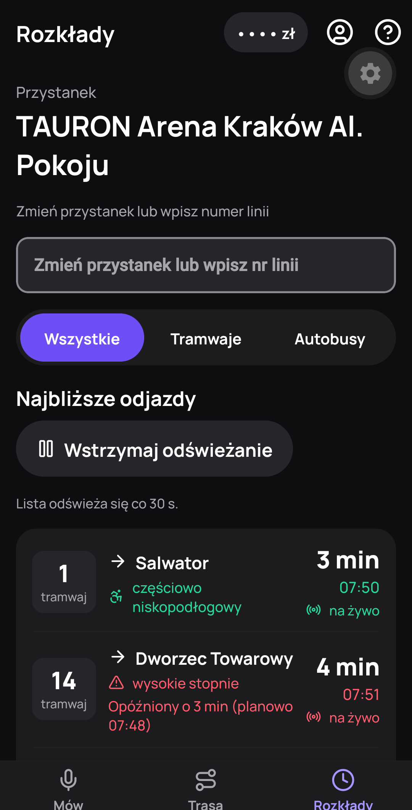
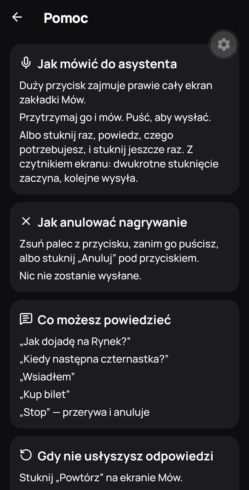

# HearWeGoKrk

A voice assistant for public transport in Kraków, built for blind and visually impaired people,
and useful to anyone who would rather ask than read a timetable.

You press one big button and speak. HearWeGoKrk guides you to the transit stop, plans the route, reads live departures, says
whether the vehicle is low-floor, buys a ticket that lasts the whole ride, and tells you when
to get off. Everything it says is also shown on screen in large type, so a sighted companion
can read along.

<p align="center">
  
  
  
</p>

## What you can say

| You say | HearWeGoKrk |
|---|---|
| "Jak dojadę na Rynek?" | Line, stop, how many minutes, whether the vehicle is low-floor, arrival time |
| "Kiedy następna czternastka?" | The next tram 14 from the nearest stop that serves it. If it has high steps, it offers to wait for the next low-floor one |
| "Czy się spóźni?" | The delay, and whether the answer comes from live data or the timetable |
| "Wsiadłem" / "Jestem w HG 935" | Finds the vehicle you are in by GPS, or by the side number (*numer boczny*) on the sticker by the door |
| "Kup bilet" | Asks only for what it doesn't know yet (normalny or ulgowy, and how long or where to), reads the ticket back with all its details, and buys it after you say "tak" |
| "Jestem w HG 935, jadę do Ronda Grunwaldzkiego, kup bilet ulgowy" | The whole ride in one sentence: the ticket covers the live travel time to that stop |
| "Ile mam pieniędzy?" | The balance. Without headphones it asks before saying amounts aloud |
| "Powtórz" · "Stop" · "Anuluj" | Repeats the last answer · cancels a pending purchase immediately |

It answers in Polish or English, whichever you speak.

### Buying a ticket

- **The right ticket, not a guess.** The ticket must last until you get off the last vehicle, plus a
  3-minute margin. The ride length comes from a route you planned earlier, from the stop you named
  (any grammatical form: "do Ronda Grunwaldzkiego"), or from a duration you said ("na pół godziny").
  If you ask for a ticket that is too short for a known ride, you are offered the right one.
- **Validated in your vehicle.** The ticket carries the side number of the vehicle you are in. It is
  filled in from GPS, or taken from the side number you say.
- **Nothing is paid without an explicit "tak".** The confirmation names the ticket, the price (only
  with headphones), how you pay, and the vehicle. Silence is not consent: after 30 seconds the app asks
  once more, then cancels. "Potrzebuję więcej czasu" restarts the countdown and never confirms.

## The app

Three tabs plus a few extra screens:

| Screen | What it shows |
|---|---|
| **Mów** | The talk button fills most of the screen. Hold and speak, or tap to start and tap to send. "Tekst rozmowy" shows the transcript, the reply and the last result; "Powtórz" replays it |
| **Trasa** | Route search with quick picks (Rynek, AGH, Dworzec Główny, Kampus UJ) and a low-floor option. Results, then the route step by step: walk, board (line, side number, low-floor, where to stand), get off |
| **Rozkłady** | Departures for the nearest or a chosen stop, filtered by line or tram/bus. Live or timetable, delays in words, refreshed every 30 s (can be paused) |
| Ticket confirmation | A bottom sheet with the ticket, vehicle, price and payment. Answer by voice (the mic opens by itself after the question) or with Potwierdź / Anuluj |
| Trip | Line and vehicle, next stop, "Wysiadasz za 2 przystanki", remaining stops. A vibration and an announcement one stop before yours |
| Ustawienia | Headphones, phone GPS, English, server address, demo mode |
| Pomoc | How to talk to the assistant, what you can say, tickets, accessibility. The help button is in the same place on every screen |

The voice is the main interface. Every agent answer that has a screen (a route, departures, the
trip) is stored there, so you can come back to it later. The app never switches screens on its own.

### Screenshots

| Tekst rozmowy | Trasa | Wyniki |
|:---:|:---:|:---:|
|  |  |  |
| The reply in large type, with the route card it produced | Destination, quick picks, low-floor vehicles | Recommended route and alternatives, live data |

| Szczegóły trasy | Wsiądź | Rozkłady |
|:---:|:---:|:---:|
|  |  |  |
| Step by step: walk, board, get off | Side number, model and low-floor of the vehicle | Live departures; a delay is red *and* spelled out |

| Potwierdź zakup | Pomoc |
|:---:|:---:|
|  |  |
| The price stays hidden until you tap "Pokaż kwotę" | How to talk, cancel and what to say |

## Accessibility

Target: [WCAG 2.2](https://www.w3.org/TR/WCAG22/) level AA, applied to a native app.

- Works with TalkBack and VoiceOver. Every card or row is one focusable element with a full-sentence
  label, e.g. "Autobus 179 w kierunku Dworzec Główny, za 2 minuty, o 15:58, na żywo, niskopodłogowy".
- Large type that follows the system font size (layouts survive 200%), dark high-contrast theme,
  touch targets of at least 48×48 dp.
- Information is never carried by colour alone: a delay is red *and* says "opóźniony o 4 min".
- Status messages (connection lost, errors, ticket notices) are announced without moving focus.

| Criterion | How the app meets it |
|---|---|
| 1.3.4 Orientation | Portrait and landscape both work |
| 1.4.3 Contrast (Minimum) | Text contrast ≥ 4.5:1 (`theme.ts`) |
| 1.4.4 Resize Text | System font scaling stays on |
| 1.4.11 Non-text Contrast | Input outlines, switches and the selected segment ≥ 3:1 |
| 2.2.1 Timing Adjustable | "Potrzebuję więcej czasu" restarts the purchase confirmation window |
| 2.2.2 Pause, Stop, Hide | The auto-refreshing departures list can be paused |
| 2.3.3 Animation from Interactions | The system "remove animations" setting turns off the pulse and slide-ins |
| 2.5.2 Pointer Cancellation | Sliding off the talk button, or "Anuluj", cancels a recording; nothing is sent |
| 2.5.7 Dragging Movements | No feature needs dragging |
| 2.5.8 Target Size (Minimum) | Every control is ≥ 48×48 dp |
| 3.2.6 Consistent Help | The help button is always the last item in the header |
| 3.3.4 Error Prevention (Financial) | Every purchase needs the confirmation sheet or a spoken "tak" |
| 3.3.7 Redundant Entry | Trasa keeps the last destination; Rozkłady keeps the last stop |
| 3.3.8 Accessible Authentication | No login or password |
| 4.1.2 Name, Role, Value | Every control has a Polish label and role; icons are hidden from screen readers |
| 4.1.3 Status Messages | Announced without moving focus (`a11y.ts`) |

Not tested yet: focus visibility with a hardware keyboard (2.4.7, 2.4.11), and the language of
English replies for screen readers (3.1.2).

**AI disclosure (AI Act).** Every conversation starts with "Rozmawiasz z asystentem głosowym AI."
The server adds it, so it does not depend on the language model.

## How it works

```
React Native (Expo)  ──audio + GPS──▶  FastAPI  ──▶  ElevenLabs Scribe (speech → text)
        ▲                                  │
        │                                  ▼
        │                  Claude tool calling (llm_agent.py)
        │                  └─ falls back to the rule-based agent (agent.py)
        │                                  │
        │                    tools ──▶ transit data (mock_realtime.py)
        │                                  │         wallet and tickets (wallet.py)
        │                                  ▼
        └──────audio + text + haptics──  ElevenLabs (text → speech)
```

- **Speech to text**: ElevenLabs Scribe. It accepts both the PCM audio iOS records and the AAC audio
  Android records.
- **Agent**: Claude calls the tools in `tools.py`. If the API is unreachable, a rule-based agent answers
  instead; it covers routes, departures, boarding, tickets, balance and cancelling on its own.
- **Text to speech**: ElevenLabs streams the reply in Polish or English. Without a key the phone
  speaks the reply with its own voice.
- **Money safety lives in code, not in the prompt** (`wallet.py`): preparing a ticket moves no money,
  a confirmation in the same turn as the preparation is refused, and a pending purchase expires.

### Repository

```
app.py            FastAPI app: REST endpoints, demo controls
voice_ws.py       WebSocket: audio in → speech to text → agent → text to speech; confirmation and trip timers
llm_agent.py      Claude tool-calling agent
agent.py          agent entry point and the rule-based agent
tools.py          the tools the agent can call
wallet.py         wallet, ticket choice by ride length, purchase state machine
session.py        per-conversation state
speech.py         ElevenLabs speech to text and text to speech
mock/             transit data and the real-time simulator
scripts/          agent evaluation, TTSS snapshot
tests/
mobile/src/
  app/            screens (expo-router)
  agent/          AgentContext (WebSocket and state), audio, location
  components/     route cards, departures, confirmation sheet, talk button
```

## Running it

```bash
python -m venv .venv && .venv/bin/pip install -r requirements.txt
cp .env.example .env          # ANTHROPIC_API_KEY, ELEVENLABS_API_KEY, ELEVENLABS_VOICE_ID
.venv/bin/uvicorn app:app --host 0.0.0.0 --port 8000 --env-file .env

cd mobile && npm install && npx expo start   # scan the QR code with Expo Go
```

- The phone and the computer must be on the same network. The app connects to
  `http://<computer-ip>:8000` by default; change it in Ustawienia → Serwer or with
  `EXPO_PUBLIC_BACKEND_URL` in `mobile/.env`.
- `GET /health` shows whether the language model, speech to text and text to speech are configured.
  API docs: `http://localhost:8000/docs`.
- Without `ANTHROPIC_API_KEY` (or with `AGENT` empty) only the rule-based agent runs. Without
  `ELEVENLABS_API_KEY` there is no voice input, and the phone speaks with its own voice.

| Variable | Default | Purpose |
|---|---|---|
| `AGENT` | – | `claude` turns on the Claude agent |
| `ANTHROPIC_API_KEY` | – | Claude API key |
| `AGENT_MODEL` / `AGENT_EFFORT` | `claude-opus-5-5` / `low` | Model and effort for the agent |
| `ELEVENLABS_API_KEY` | – | Needs both Speech to Text and Text to Speech access |
| `ELEVENLABS_VOICE_ID` | – | A voice that speaks Polish |
| `ELEVENLABS_STT_MODEL` / `ELEVENLABS_MODEL` / `ELEVENLABS_FORMAT` | `scribe_v2` / `eleven_flash_v2_5` / `mp3_44100_128` | Speech models and audio format |

### Tests and evaluation

```bash
.venv/bin/python -m pytest -q                              # backend; Claude and ElevenLabs are faked
.venv/bin/python scripts/compare_agents.py rules claude    # golden set (mock/demo_scenarios.json)
.venv/bin/python scripts/ticket_loop.py rules claude -n 2  # a simulated passenger buys tickets
cd mobile && npx tsc --noEmit && npx expo lint
```

`compare_agents.py` runs the 12 typical, hard and high-risk cases from `mock/demo_scenarios.json`
and checks the tools called, the safety rules and latency. In `ticket_loop.py`, Claude plays a
passenger who knows their vehicle, destination or ticket length, and fare, and reveals them only
when asked. The script checks that the agent prepares exactly the right ticket and that no money
moves before "tak". Both scripts call the Claude API when given `claude`.

## Data

Transit data is simulated (`mock/`), based on a real snapshot of Kraków's TTSS (the system behind
ttss.pl). Departures count down, vehicles move along their lines, and delays appear.

| File | Contents |
|---|---|
| `ttss_snapshot.json` | Raw TTSS extract: vehicles and real trips |
| `stops.json` | Stop names, order and coordinates from TTSS; step-free, tactile and voice-board flags (`null` = unknown) |
| `lines_and_vehicles.json` | Trams 1, 12, 14 and buses 124, 424 from TAURON Arena: stop order, travel times, and vehicles with side number, model, low-floor (full / partial / none) and source (`ttss` or `illustrative`) |
| `routes.json` | Route templates from TAURON Arena, destination aliases, ambiguous names ("rondo") |
| `account_and_tickets.json` | User profile, wallet, card, ticket catalog (15, 30, 60, 90 min, normalny and ulgowy), confirmation phrases |
| `demo_scenarios.json` | The golden set used by `compare_agents.py` |
| `mock_realtime.py` | The simulator |

`scripts/ttss_snapshot.py` refreshes the snapshot from live TTSS. It does not know the hand-added
data (bus 424 and its fleet, bus DE777, the extra bus 124 stops, new stops in `stops.json`) and
would drop it; `tests/test_backend.py::test_mock_data_is_consistent` catches broken references.
Vehicles marked `illustrative` (e.g. the high-floor tram RZ105) are not in the live fleet.

### Demo mode

Ustawienia → Tryb demo controls the simulation, so the app can be shown without riding a tram:

- **Reset demo (start)**: restarts the clock and the wallet. The first tram 14 is then the high-floor
  RZ105, 3 minutes late, and the next one (HY712) is low-floor.
- **Wsiadam do autobusu DE777 (+11 min)**: moves the clock forward and puts the phone in bus 124
  DE777, keeping the conversation. Ask "Jak dojadę na Rondo Mogilskie?" within 5 minutes of the reset
  to get DE777 as the planned bus; after boarding, the ticket covers the 19 minutes left to Rondo Mogilskie.
- **Wsiadam do HG935 (+12 min)**: puts the phone in tram 12 HG935, with a fresh conversation.
- **Wyczyść sztuczny GPS**: back to the phone's real position.

A short walkthrough: "Jak dojadę na Rynek?" → "Kiedy następna czternastka?" (high-step warning and an
offer to wait) → "Jak dojadę na Rondo Mogilskie?" → Wsiadam do autobusu DE777 → "Wsiadłem" →
"Bilet normalny czy ulgowy?" → "Ulgowy" → confirmation → "Tak".

## Reference

### Agent tools (`tools.py`)

| Tool | Arguments | Returns |
|---|---|---|
| `plan_route` | `destination`, `prefer_low_floor?` (default: user profile) | `status` (ok / ambiguous / not_found / no_route), `best`, `alternatives`, `data_source`. Remembers where to get off and the legs to ride |
| `get_departures` | `stop_id?`, `line_id?`, `mode?` (`tram` / `bus`), `low_floor_only?`, `limit?` | `stop_name` and `departures` with `eta_min`, `delay_min`, `data_source`, `vehicle`. Without `stop_id`: the nearest stop served by that line or mode |
| `match_boarded_vehicle` | `line_id?` (position from GPS) | `matched`, vehicle, `trip`. Sets the vehicle for the ticket |
| `set_vehicle` | `side_number` as spoken ("HG 935", "935") | vehicle and `trip`. Sets the vehicle for the ticket |
| `vehicle_status` | `side_number?` (default: current vehicle) | position, remaining stops with ETA |
| `list_tickets` | `fare?` (`full` / `reduced`) | ticket catalog |
| `get_balance` | – | balance, default card, `speak_amount_aloud`, active tickets |
| `prepare_ticket` | `fare?`, `duration_min?`, `get_off?`, `ticket_id?`, `side_number?` | `status: needs_info` with a `question`, or `pending_action_id`, `confirmation_text`, `ticket_id`, `trip_min`, `covers_trip`. No money moves |
| `confirm_pending_action` | `pending_action_id` | the bought ticket, new balance |
| `cancel_pending_action` | – | what was cancelled |

`prepare_ticket` needs the fare and how long the ticket should last: `duration_min`, the `get_off`
stop, or a planned route. Without them it returns a question and prepares nothing. The ride length
(`wallet.trip_minutes`) is the vehicle's live ETA to the stop where the user gets off, plus any
planned legs after it (transfers); before boarding, the planned ride from the first vehicle.
`prepare_ticket` and `confirm_pending_action` are never accepted in the same turn.

### WebSocket `/ws/voice`

Client → server:
```json
{"type": "context", "gps": true, "lat": 50.06, "lon": 19.98, "headphones": true, "lang": "pl"}
{"type": "audio_chunk", "data": "<base64>"}
{"type": "end_of_speech"}
{"type": "text", "text": "Jak dojadę na Rynek?"}
{"type": "stop"}
{"type": "extend_pending", "id": "<pending_action_id>"}
{"type": "listening", "id": "<pending_action_id>"}
```
- `audio_chunk`: PCM16 16 kHz mono (iOS) or AAC in `.m4a` (Android); the format is detected.
- `context`: `gps: false` makes the backend forget the phone's position.
- `text`: typed input, for tests and as an alternative to speech.
- `extend_pending`: restarts the confirmation window of a pending purchase. It never confirms.
- `listening`: the phone has read the purchase question and opened the mic. The silence timer restarts,
  but silence still ends in one retry and then a cancel. When a turn prepares a purchase, the server
  speaks only the `confirmation_text`, and the window starts after it has been read out.

Server → client:
```json
{"type": "session", "id": "a1b2c3d4"}
{"type": "state", "value": "listening | thinking | speaking | idle"}
{"type": "transcript", "text": "jak dojadę na rynek"}
{"type": "reply_text", "text": "Tramwaj 1 za 2 minuty...", "speak": "optional"}
{"type": "audio_chunk", "data": "<base64 mp3>"}
{"type": "haptic", "pattern": "confirm | warning | arrived"}
{"type": "ui", "component": "route_results | departures | ticket_confirm | trip_live", "data": {}}
{"type": "pending_confirmation", "id": "pa_1a2b3c", "timeout_s": 30, "data": {"...": "prepare_ticket result"}}
{"type": "pending_cancelled", "id": "pa_1a2b3c"}
{"type": "error", "message": "..."}
```
- `reply_text.speak`: only on the first reply, which starts with the AI disclosure; it spells "AI" the way
  the Polish voice should say it. The phone shows `text` and, without server audio, speaks `speak ?? text`.
- `ui`: sent after each tool result that has a screen: `route_results` (`plan_route`), `departures`
  (`get_departures`), `ticket_confirm` (`prepare_ticket`), `trip_live` (`match_boarded_vehicle`,
  `set_vehicle`, `vehicle_status`, and the trip monitor every ~10 s). Unknown components are ignored.

### REST

| Endpoint | Purpose |
|---|---|
| `GET /health` | clock, and whether the language model, speech to text and text to speech are configured |
| `GET /stops` · `GET /stops/{id}/departures` · `GET /vehicles/{side}` | transit data |
| `POST /route` · `GET /wallet` · `GET /tickets/catalog` | the same data the tools return |
| `GET /tools/schemas` | tool definitions given to Claude |
| `POST /agent/text` · `GET /sessions/{id}/log` | talk to the agent without the phone; a session's action log |
| `POST /demo/reset` (`offset_min`) | restart the clock and wallet, clear the simulated GPS, reset open conversations |
| `POST /demo/clock` (`offset_min`) | move the clock forward; conversations, planned route and wallet stay |
| `POST /demo/gps` (`side_number`, or `lat` + `lon`) · `DELETE /demo/gps` | simulated GPS |

## Limitations

- Transit data is simulated from a TTSS snapshot; connecting live TTSS / GTFS-Realtime is the next step.
- The wallet, card and purchases are simulated. Ticket prices are placeholders (reduced fares from
  public sources, full fares assumed to be double); check them at ztp.krakow.pl.
- Routes are planned from TAURON Arena to a fixed set of destinations.
